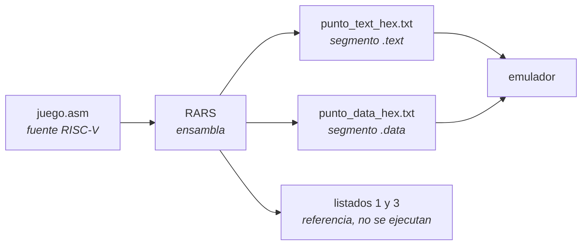
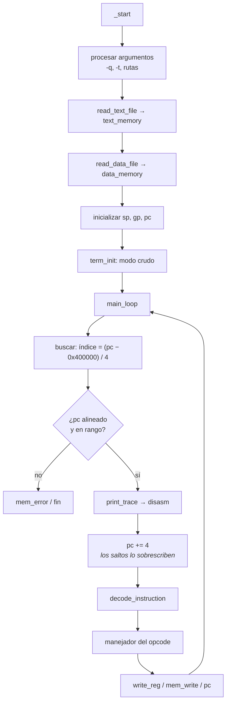
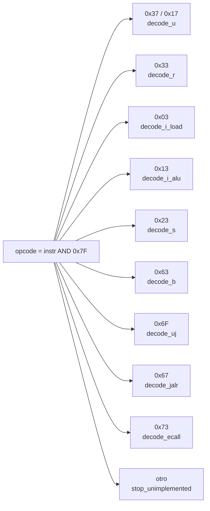
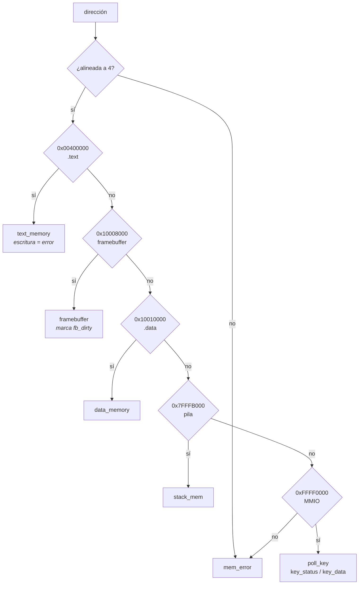
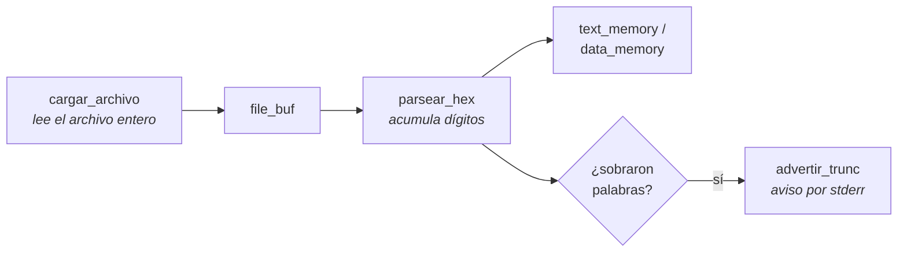
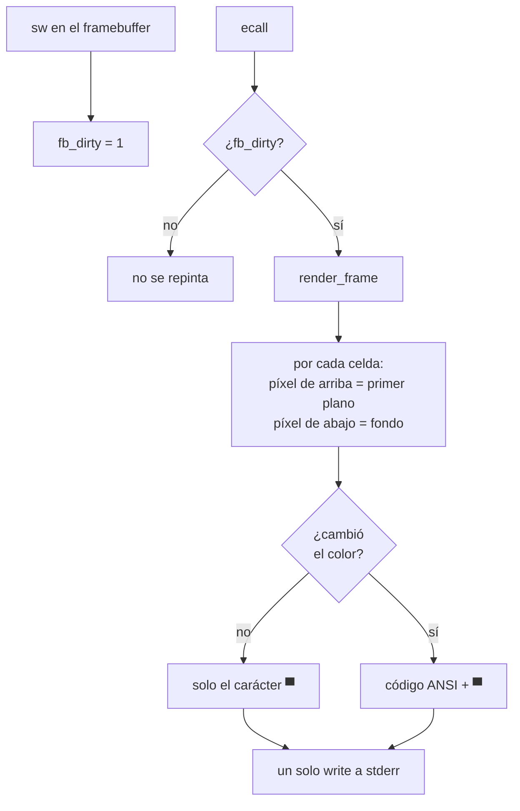

# Guía del código de `emulador.asm`

Este documento recorre el emulador por dentro: qué hace cada parte, en qué
orden, y por qué está resuelta así. El README explica *qué* hace el proyecto y
*por qué* se tomaron ciertas decisiones; esto explica *cómo* está construido,
para quien vaya a leer o modificar el código.

Está en español porque los comentarios del código lo están. La documentación
hacia afuera (el README) está en inglés.

---

## Cómo está organizado el archivo

El archivo creció por etapas, y cada etapa fue añadiendo rutinas al final. Eso
significa que **el orden físico no coincide con el orden lógico**: `decode_b`
está mucho más abajo que `decode_r` aunque sean hermanas, y las rutinas de
video quedaron intercaladas entre las de memoria. No es ideal, pero reordenarlo
tendría el riesgo de un refactor grande sin beneficio funcional. El índice de
abajo compensa.

| Línea | Bloque | Qué contiene |
|---|---|---|
| 3 | `.data` | constantes, mapa de memoria, mensajes, tabla de mnemónicos |
| 171 | `.bss` | todo el estado emulado y los buffers |
| 232 | `_start` | argumentos, carga de archivos, inicialización |
| 334 | `main_loop` | ciclo buscar-decodificar-ejecutar |
| 384 | `decode_instruction` | despachador por opcode |
| 425–780 | decodificadores U, R, J | `lui`, `auipc`, tipo R, tipo M, `jal` |
| 780–975 | carga de archivos | lectura y parseo de los volcados |
| 993–1077 | traza y paradas | impresión, volcado de registros, errores |
| 1089–1202 | memoria | `mem_read`, `mem_write` |
| 1202–1320 | cargas y almacenamientos | tipo I de carga, tipo S |
| 1391–1626 | tipo I aritmético, ramas, `jalr` | |
| 1641–1732 | formateo de números | decimal, lectura de enteros |
| 1732–1920 | `ecall` | los diez servicios de RARS |
| 1920–2103 | video | emisores ANSI y `render_frame` |
| 2103–2241 | terminal y teclado | modo crudo, `poll_key` |
| 2241–2712 | desensamblador | emisores de texto, `disasm`, inmediatos |
| 2712–2801 | accesos de byte y media palabra | |
| 2801–2866 | contadores CSR | `rdcycle`, `rdtime`, `rdinstret` |

---

## De dónde salen los archivos

Antes de leer el código conviene tener claro que el emulador **no lee
ensamblador**. Lee dos volcados hexadecimales que RARS produjo antes.



Los listados desensamblados no los usa el emulador: son la fuente independiente
contra la que se validó el desensamblador propio.

---

## El ciclo principal



Tres cosas de este diagrama merecen atención.

**`r12d` guarda el PC de la instrucción actual** antes de incrementarlo. Todo lo
que calcula direcciones relativas al PC —`auipc`, `jal`, `jalr`, las ramas— lee
`r12d` y no `registers[32]`, porque para cuando se ejecutan, el PC ya avanzó. Es
el error más fácil de cometer en este diseño y desplaza todos los resultados
cuatro bytes.

**La traza se imprime antes de ejecutar**, no después. Así, si una instrucción
provoca un error, su línea ya está en el archivo.

**El incremento va antes de la ejecución**, no después. La alternativa —comparar
si el PC cambió y sumar 4 solo si no— no puede representar un salto a la propia
dirección, que es como el Pong marca su final con `j 0`.

---

## Despacho por opcode

`decode_instruction` (línea 384) enmascara los siete bits bajos y compara en
cadena:



Cada decodificador extrae sus campos a variables compartidas (`rd`, `rs1`,
`rs2`, `funct3`, `funct7`, `imm`) y vuelve a despachar sobre `funct3` para
elegir la operación concreta. El opcode `0x33` tiene un paso extra: mira
`funct7` primero, porque el valor `0x01` ahí selecciona la extensión M en vez
de la ALU básica. Y `0x73` mira `funct3`: cero significa `ecall`, cualquier
otro valor es una instrucción CSR.

Una cadena de comparaciones con doce casos es más lenta que una tabla de saltos
indexada por opcode. Se mantuvo así por legibilidad; convertirla es un cambio
contenido si algún día importa el rendimiento.

---

## Los formatos de inmediato

Aquí vive la mayor parte de la sutileza del ISA. Cada formato reparte el
inmediato de forma distinta dentro de los 32 bits.

```
tipo I   [31..............20][19..15][14..12][11..7][6....0]
             imm[11:0]         rs1    funct3    rd    opcode

tipo S   [31.......25][24..20][19..15][14..12][11...7][6....0]
           imm[11:5]    rs2     rs1    funct3 imm[4:0] opcode

tipo B   [31][30....25][24..20][19..15][14..12][11...8][7][6....0]
          i12  imm[10:5]  rs2    rs1    funct3 imm[4:1] i11 opcode

tipo U   [31...........................12][11..7][6....0]
                    imm[31:12]               rd    opcode

tipo J   [31][30........21][20][19......12][11..7][6....0]
          i20   imm[10:1]   i11  imm[19:12]   rd    opcode
```

El truco central es que **`sar` hace la extensión de signo gratis**. Un
desplazamiento aritmético a la derecha mueve el campo a la parte baja y replica
el bit 31 hacia arriba en la misma instrucción:

| Formato | Extracción | Por qué |
|---|---|---|
| I | `sar ecx, 20` | un solo paso, signo incluido |
| S | `sar ecx, 25`, `shl 5`, y se pega `instr[11:7]` | viene partido en dos |
| B | se arman cuatro trozos, luego `shl 19` / `sar 19` | 13 bits en 12 codificados |
| U | `shr ecx, 12` | no lleva signo, ya está posicionado |
| J | cuatro trozos, luego `shl 11` / `sar 11` | 21 bits en 20 codificados |

Usar `shr` en lugar de `sar` convierte todo desplazamiento negativo en un valor
positivo enorme. Fue el primer error que tuvo el emulador, en `jal`.

El tipo B cubre trece bits usando solo doce codificados porque el bit 0 siempre
vale cero: los saltos van a direcciones pares. Por eso su extensión de signo
usa 19 y no 20.

---

## El subsistema de memoria

Las direcciones RISC-V abarcan de `0x00400000` a `0xFFFF0004`, un espacio de
4 GB del que solo existen unas pocas ventanas. `mem_read` (1089) y `mem_write`
(1149) son el decodificador de direcciones:



En cada región la traducción es la misma resta y división entre cuatro que hace
la búsqueda de instrucciones, generalizada de una región a cinco.

Dos detalles que no son obvios:

**Las comparaciones van sin signo** (`jb`/`jae`, no `jl`/`jge`). Con
comparaciones con signo, `0xFFFF0000` sería un número negativo y la región MMIO
nunca caería dentro de ningún rango.

**La región del framebuffer es más grande que lo visible.** Abarca hasta
`0x10010000` aunque solo se dibujen las primeras 2048 palabras. En RARS el
segmento de datos cubre todo ese rango, así que un programa que dibuje una fila
por debajo de la pantalla escribe en memoria válida y simplemente no se ve. Un
emulador que abortara ahí sería más estricto que su referencia.

Los accesos de byte y media palabra (2712–2801) se apoyan en los de palabra: la
lectura trae la palabra que contiene el byte y desplaza; la escritura hace
leer-modificar-escribir para conservar los otros bytes. El desplazamiento en
bits sale de los bits bajos de la dirección por ocho, lo que asume que el
anfitrión es little-endian igual que RISC-V — cierto en x86.

---

## El banco de registros

`read_reg` (1077) y `write_reg` (473) son dos rutinas de cinco líneas, pero
concentran una garantía del ISA:

```nasm
write_reg:              ; ecx = índice, eax = valor
    test ecx, ecx
    jz .done            ; x0 está cableado a cero: se ignora la escritura
    mov r10d, ecx
    mov dword [registers + r10*4], eax
.done:
    ret
```

Que **toda** escritura a registro pase por aquí es lo que convierte la regla de
`x0` en una línea de código, en vez de en algo que recordar en cuarenta puntos
distintos. El valor cero de `x0` en la lectura no necesita código: `.bss` arranca
en cero y nadie lo escribe nunca.

El PC vive en `registers[32]`, dentro del mismo arreglo. Por eso el volcado de
registros es un simple bucle sobre memoria contigua.

---

## Convenciones de registros del anfitrión

El emulador no honra ninguna ABI externa, así que define las suyas. Sostenerlas
es lo que evita que el código se vuelva un baile de registros.

| Registro | Papel |
|---|---|
| `edx` | instrucción actual, que recibe `decode_instruction` |
| `r12d` | PC de la instrucción en curso (antes del incremento) |
| `r13d` | instrucción actual, sobrevive a las llamadas |
| `rbx` | base de `registers`, se recarga donde hace falta |
| `r10d`, `r11d` | temporales de las rutinas de memoria |
| `rdi` | cursor de escritura en todos los emisores de texto |

Dos convenciones de llamada mueven casi todo el tráfico. `read_reg` recibe el
índice en `ecx` y devuelve el valor en `eax`; `write_reg` recibe el índice en
`ecx` y el valor en `eax`.

La segunda gobierna la salida de texto: **todo emisor escribe en `[rdi]` y deja
`rdi` apuntando justo después de lo escrito**. `put_hex8`, `emit_dec8`, `e_reg`,
`e_coma`, `e_dec` y `e_str` la respetan, así que una línea se construye
llamándolos en secuencia y la longitud final es simplemente cuánto avanzó el
puntero. Ningún emisor necesita saber ni devolver una longitud.

### El peligro que hay que tener presente

`syscall` **destruye `rcx` y `r11`**, y `div` escribe su resto en `rdx` — que es
donde vive la instrucción actual. `decode_csr` extraía originalmente su registro
destino *después* de llamar a la rutina del reloj, así que `rdtime` escribía en
el registro que nombraran los nanosegundos sobrantes. Fallaba una de cada seis
corridas. Ahora el destino se extrae primero y se empuja a la pila.

Si agrega código que haga un `syscall` o una división en medio de la ejecución
de una instrucción, revise qué había en `rcx`, `r11` y `rdx`.

---

## Carga de los volcados



La versión original leía el archivo en trozos de nueve bytes, justo el tamaño de
"ocho dígitos más salto de línea". Funcionaba de milagro: con CRLF, con espacios
o con una lectura parcial se desincronizaba y perdía los dígitos a medio
acumular.

Ahora se lee el archivo completo y después se parsea. `parsear_hex` (821)
acumula dígitos hexadecimales y **cualquier carácter que no lo sea cierra la
palabra en curso**. Eso hace que dé igual cómo estén separadas las líneas:
mayúsculas, minúsculas, LF, CRLF, espacios, tabuladores o un archivo sin salto
final, todo funciona.

Si el volcado no cabe en su arreglo, `advertir_trunc` (900) lo dice por stderr
con las cifras exactas. Sin ese aviso, el emulador descartaba instrucciones en
silencio y el programa terminaba solo, sin error visible — el peor tipo de
fallo, y uno que costó un rato de confusión con el Bomberman.

---

## Video



El carácter de medio bloque superior `▀` pinta **dos píxeles por celda**: el
color de primer plano es el de arriba y el de fondo el de abajo. Así la rejilla
de 64×32 entra en 64×16 caracteres y conserva la proporción; con un carácter por
píxel la imagen saldría el doble de alta, porque las celdas de terminal son más
altas que anchas.

Las dos optimizaciones importan más de lo que parece. Emitir el color solo
cuando cambia baja el cuadro de unos 42.000 bytes a unos 9.700. Y repintar solo
en el `ecall`, que es la frontera natural entre cuadros, evita casi 3.000
repintados por cuadro.

La bandera `fb_dirty` tiene un segundo efecto: los programas de puro texto nunca
tocan el framebuffer, así que nunca la levantan y el renderizador nunca corre.
Su salida no se ensucia con códigos de escape.

---

## Teclado

`poll_key` (2190) se engancha en la ruta MMIO de `mem_read`, o sea justo en el
momento en que el programa emulado pregunta si hay tecla. No necesita un bucle
propio.

La terminal se pone en modo crudo apagando tres banderas de `c_lflag`:

| Bandera | Efecto de apagarla |
|---|---|
| `ICANON` | los bytes llegan sin esperar Enter |
| `ECHO` | las teclas no se dibujan sobre el tablero |
| `ISIG` | Ctrl+C llega como el byte `0x03`, no como señal |

Apagar `ISIG` es deliberado: permite que el emulador atienda la interrupción y
restaure la terminal antes de salir. Con `ISIG` encendido el proceso moriría de
golpe y la terminal quedaría en modo crudo y sin eco, obligando a escribir
`reset` a ciegas.

`VMIN` y `VTIME` van en cero para que `read` devuelva de inmediato lo que haya o
nada. Además `stdin` se marca `O_NONBLOCK`: es redundante con una terminal en
modo crudo, pero imprescindible si la entrada viene de una tubería, donde el
emulador se congelaría.

---

## Traza y desensamblador

`disasm` (2305) es un desensamblador completo, **independiente de la
ejecución**. Tiene sus propios extractores de inmediato (`imm_uj`, `imm_b`,
`imm_s`, líneas 2638–2712) y sus propias variables de campos (`d_rd`, `d_rs1`,
…) en vez de compartir las que usan los manejadores.

Esa duplicación es intencional: leer una instrucción no debe alterar ningún
estado. Si compartieran variables, la traza podría corromper la ejecución o al
revés, y una herramienta de depuración que cambia el comportamiento que observa
es peor que no tener ninguna.

Cada línea se escribe con un `write` directo, sin buffer intermedio. Cuesta
llamadas al sistema, pero garantiza que no se pierde nada aunque el proceso
muera de golpe — que es exactamente cuando las últimas líneas importan.

---

## Manejo de errores

| Rutina | Línea | Cuándo |
|---|---|---|
| `open_error` | 1052 | el archivo de entrada no existe |
| `advertir_trunc` | 900 | el volcado no cupo (avisa y sigue) |
| `stop_unimplemented` | 1030 | opcode desconocido |
| `mem_error` | 1357 | dirección no mapeada, desalineada o de solo lectura |
| `ecall_error` | 1889 | servicio o CSR no implementado |

Todas menos `advertir_trunc` imprimen el contexto, vuelcan los 32 registros,
restauran la terminal y salen con un código distinto. **Ninguna ruta produce un
fallo de segmentación.**

Escribir sobre `.text` se trata como error a propósito. RISC-V permite código
automodificable, pero en la práctica un `sw` a la memoria de programa es casi
siempre un puntero descarriado, y es preferible verlo de inmediato a corromper
una instrucción que todavía no se ejecutó y perseguir el síntoma mil
instrucciones después. Habilitarlo es cambiar una línea.

El mismo razonamiento explica los chequeos de alineación. En un emulador uno
depura dos programas a la vez —el anfitrión en x86 y el huésped en RISC-V— y sin
estos guardarraíles no hay forma de saber cuál de los dos está fallando.

---

## Cómo agregar una instrucción

Suponga que quiere añadir `andn` (una operación de la extensión B). El recorrido
es siempre el mismo:

1. **Ubique el opcode y el formato.** Si es tipo R, ya hay decodificador: solo
   hace falta un caso más en el despacho por `funct3`/`funct7` dentro de
   `decode_r`. Si el formato es nuevo, hace falta un decodificador nuevo y una
   comparación más en `decode_instruction`.
2. **Escriba la ejecución.** Los operandos ya están: `r11d` tiene `R[rs1]` y
   `eax` tiene `R[rs2]`. Deje el resultado en `r11d` y salte a `.r_store`.
3. **Agregue el mnemónico.** Una entrada de seis bytes en la tabla de `.data` y
   un caso en el `disasm` correspondiente. Si no lo hace, la traza dirá `?`.
4. **Escriba la prueba.** En `tests/`, siguiendo el patrón: calcule en `a0`,
   ponga el esperado en `a1`, llame a `check`. Incluya al menos un caso con el
   bit 31 activo, que es donde aparecen los errores de signo.
5. **Rompa la implementación a propósito** y confirme que la prueba lo detecta.
   Si sobrevive la mutación, la prueba no está cubriendo lo que cree.

---

## Cómo depurar cuando algo falla

El volcado de registros que acompaña a cada error suele bastar para reconstruir
qué pasó. El procedimiento que funcionó una y otra vez durante el desarrollo:

**Corra con traza a archivo** y mire el final:

```bash
./emulador -t traza.txt programs/algo/punto_text_hex.txt programs/algo/punto_data_hex.txt
tail -20 traza.txt
```

**Lea los registros del error.** Si es un error de memoria, la dirección
ofensora casi siempre se reconstruye desde los argumentos. Por ejemplo, en el
Bomberman el error fue en `0x1000a020` con `a0 = 8` y `a1 = 0x20`: coordenadas
x=8, y=32, y `gp + (32*64 + 8)*4` da exactamente esa dirección. De ahí salió que
el juego dibujaba una fila bajo la pantalla.

**Contraste contra RARS.** Si el programa corre bien allá y mal aquí, la
diferencia está en el emulador. Los listados desensamblados de
`programs/pong/listado_hex.txt` permiten comparar instrucción por instrucción
qué debería haber en cada dirección.

**Sospeche de los registros que destruyen las llamadas al sistema.** Los dos
errores más difíciles del proyecto —el desplazamiento de la base de `.data` y el
`rdtime` no determinista— fueron ambos de esta familia: algo escribía donde otro
esperaba encontrar un valor intacto.
